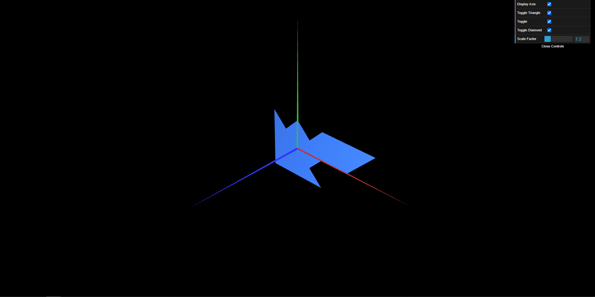
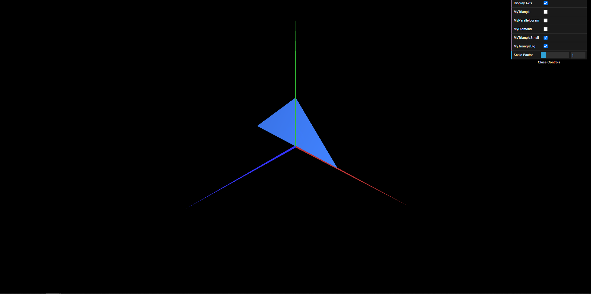

# CG 2023/2024

## Group T01G01

## TP 1 Notes

#### Exercise 1
- In exercise 1, we observed that:
    - It was easy to interact with the interface and create toggles for our objects.
    - Representing the object in the 2D axis was straightforward.
    - To represent the object on both sides, we simply needed to reverse the order in which the triangles are drawn ((0,1,2) to (2,1,0)).

#### Exercise 2
- In exercise 2, we observed that:
    - We didn't have much difficulty because it was pretty much the same thing as the previous exercise.

