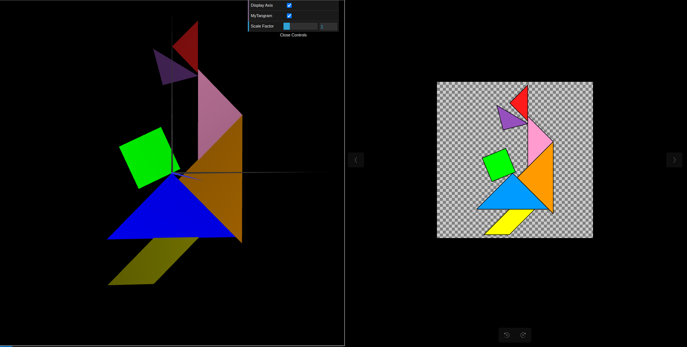

# CG 2023/2024

## Group T01G01

## TP 2 Notes

#### Funções WebCGF para transformações geométricas - Exercise 1
- In this exercise, several observations came to light:

    -  Transitioning the code from the previous TP to this one for crafting the tangram proved relatively straightforward.
    -  The incorporation of pushMatrix() and popMatrix() functions proved to be a simple and intuitive process.
    -  However, the primary challenge arose in effectively utilizing the translate and rotate functions to accurately depict the tangram shapes, particularly in achieving the desired orientation for the parallelogram figure.

#### Geometria tridimensional Cubo Unitário - Exercise 2

In this exercise, we observed that:
We didn't have much difficulty as it was pretty straightfoward.

#### Geometria composta Cubo composto por planos - Exercise 3
In this exercise, we observed that:
We didn't have much difficulty as we only needed to make some transformations to the cube from the previous exercise.

