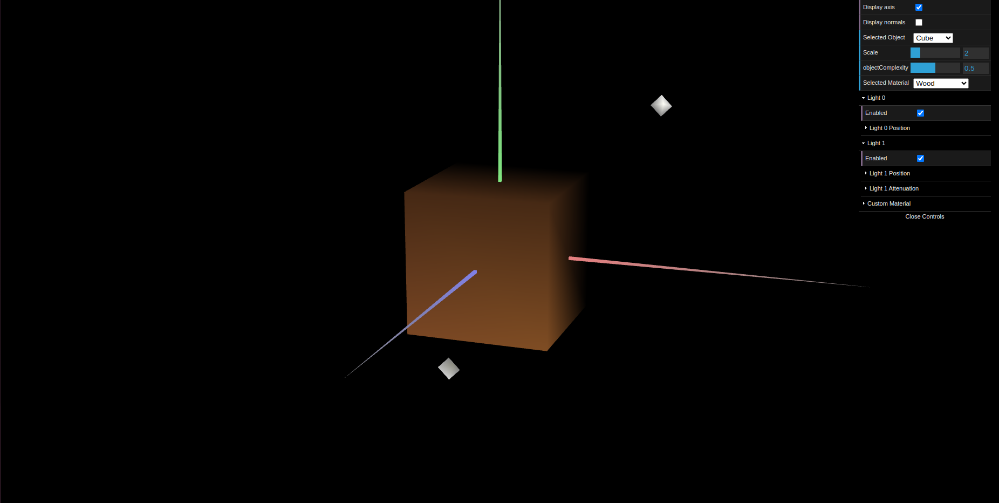
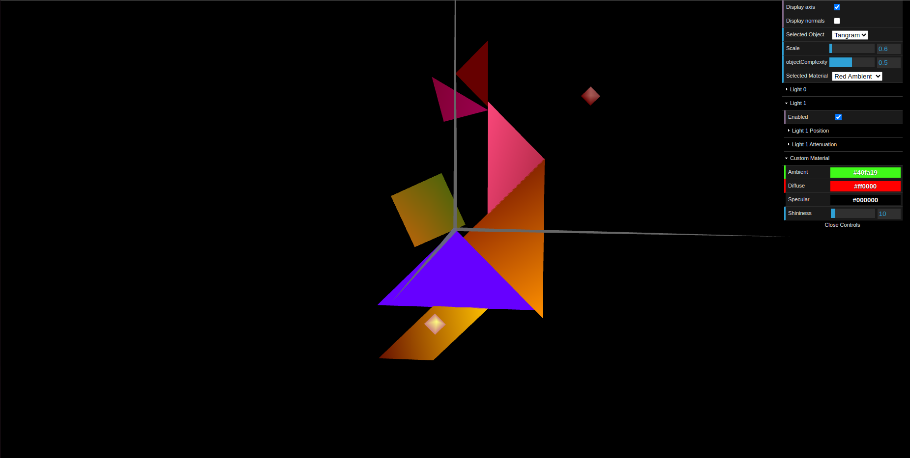
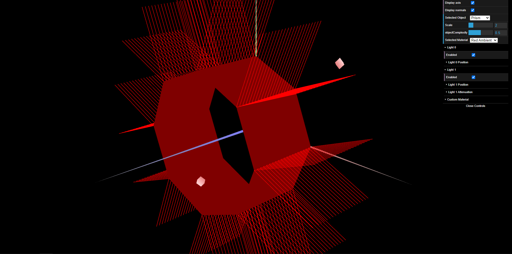
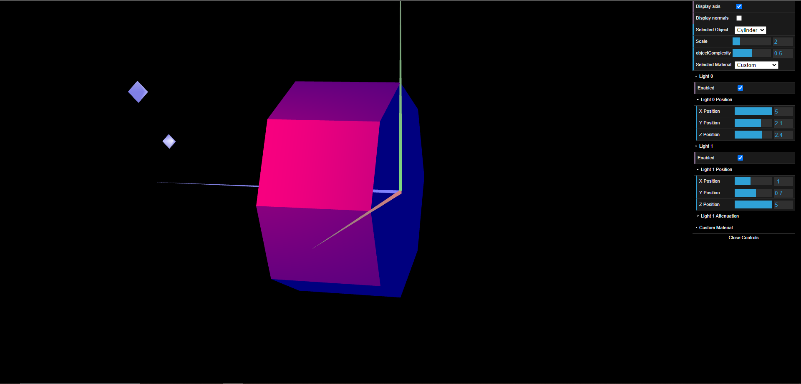

# CG 2023/2024

## Group T01G01

## TP 3 Notes

- In the first exercise, we created all normal vectors for the cube created in the previous TP so that we could see the light hit the cube at the right angles. We dyed the cube with a color similar to wood.

- We also created several materials and rebuilt the tangram created in the previous TP. The material for the "MyDiamond" piece was set to Custom.

- In the second exercise, we built a prism with a custom number of slices and stacks. We also created normals for each vertex.

 

- In the third exercise, we build a cylinder. The normals were placed perpendicular to each edge. The lighting transitions on the edges have been softened, giving a more curved appearance

 
