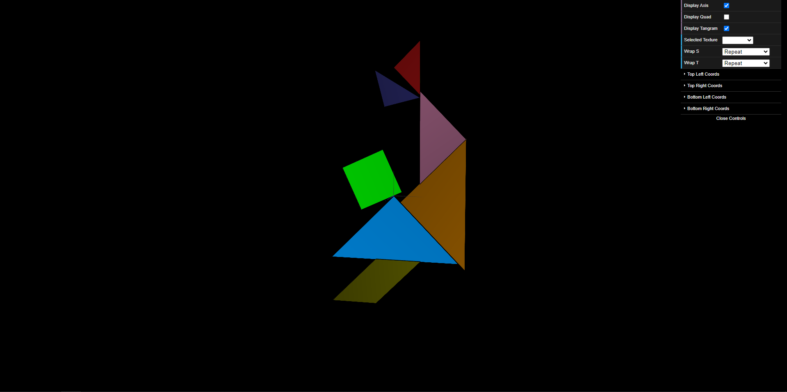
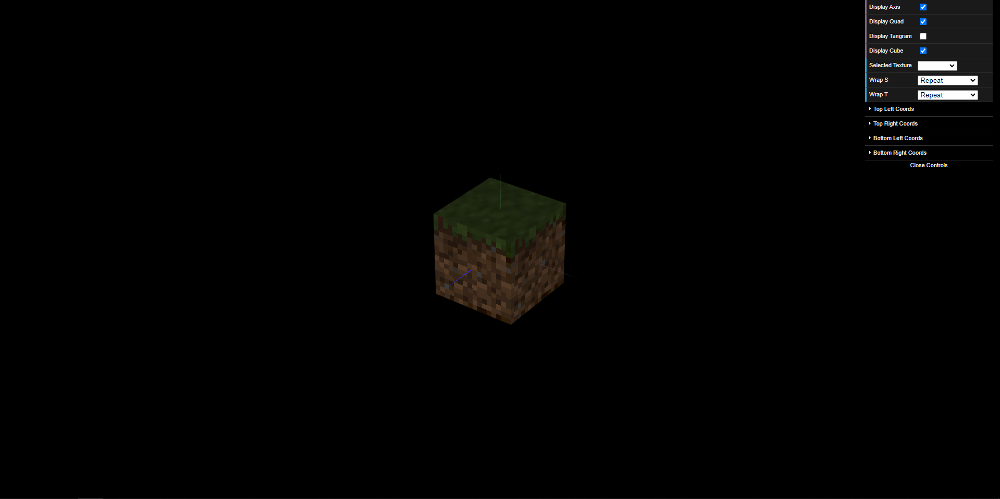

# CG 2023/2024

## Group T01G01

## TP 4 Notes

- In the first exercise, we had to change the implementation of the previously done tangram to map textures instead of colors. The most challenging part was mapping the coordinates to texture coordinates.

- In the second exercise, we had to import the MyUnitCubeQuad used in TP2 and apply to it the "mine" textures. Initially without the line `this.gl.texParameteri(this.gl.TEXTURE_2D, this.gl.TEXTURE_MAG_FILTER, this.gl.NEAREST)` the texture was blury but after applying it, it go a lot more sharper.

