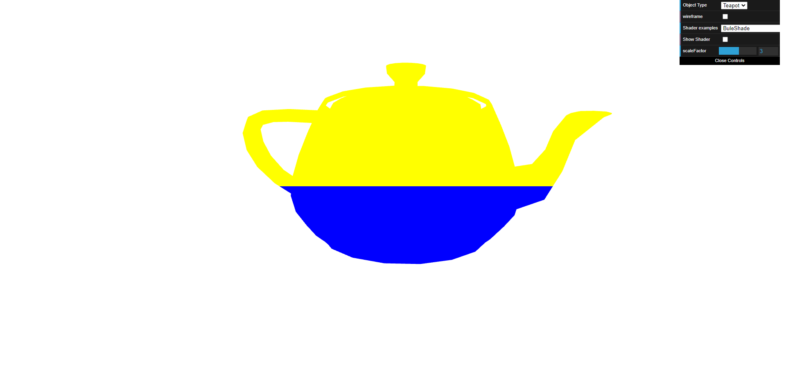
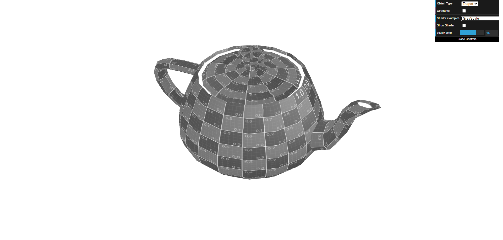
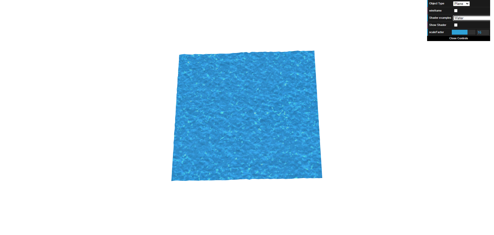

# CG 2023/2024

## Group T01G01

## TP 5 Notes

- In the first exercise, we created new vertexes and fragment shaders for the teapot. We painted the top half (>0.5) with yellow and the lower part of the teapot (<0.5) with blue.

- We also created a new shader based on the Sépia shader and we converted its color to gray.

- In the second exercise, we created a new shaders based on texture2.vert and texture2.frag. We used waterTex.jpg and waterMap.jpg for the Plane and we animated it to look like the water is moving.

